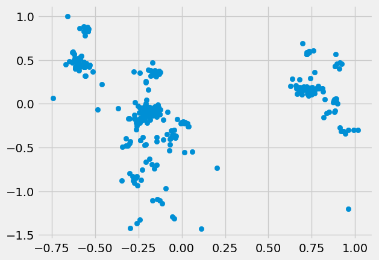
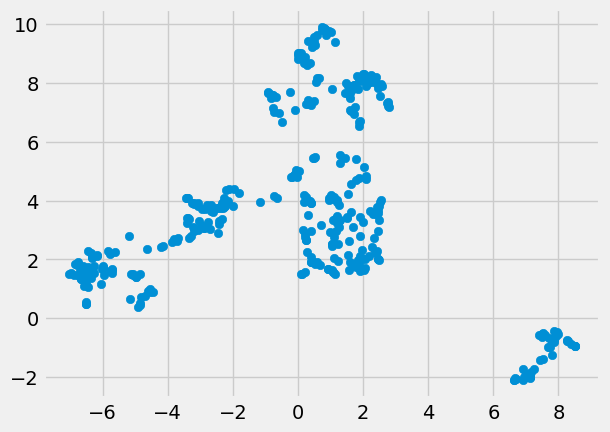
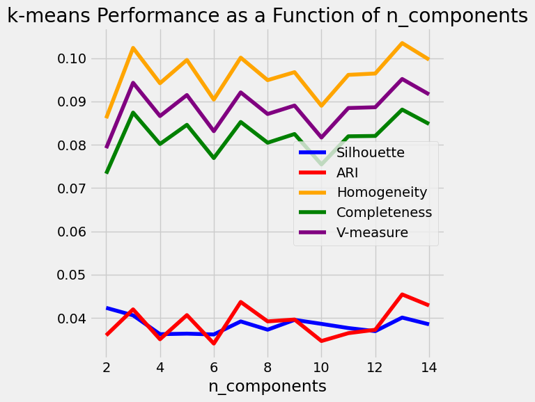
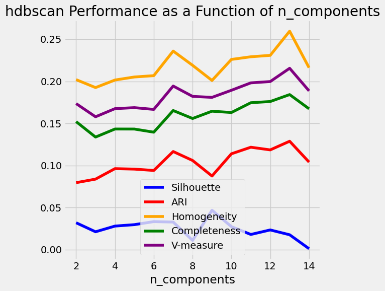
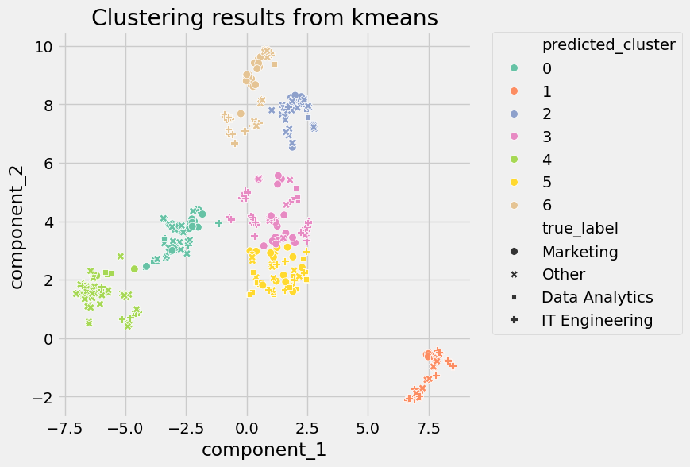
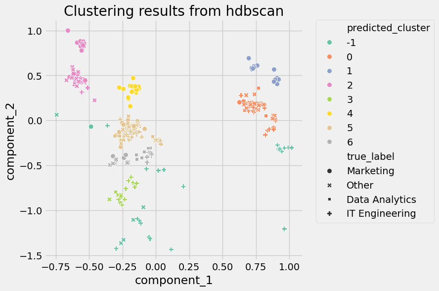

The goal of this project was to analyze short texts and find appropriate clusterings for them. These short texts represent go-to-market roles, campaigns, or touchpoints from
customer journey data. Clustering the texts helps identify patterns that can be used for tasks such as grouping similar job roles for targeted outreach, or grouping campaign types for performance analysis.

# Data Assumptions

Since the analysis involves short texts, I decided to use tools and NLP techniques that don't require large amounts of linguistic data to gain insights. Short texts typically lack grammatical structure, so analyzing this data for parts of speech, syntax, or other linguistic features reserved for large document analysis probably won't be useful in this context. Therefore, I focus on more straightforward approaches, including word counts (unigrams and bigrams) and TF-IDF.

# Tech Stack

Python is my programming language of choice because of the availability of machine learning and natural language processing libraries. I am using the following libraries:
- NLTK: customized text tokenization behavior
- scikit-learn: word vectorization, algorithm development and analysis
- matplotlib: visualizations
- pandas: data manipulation and processing, data input and output
- numpy: data manipulation and processing
- umap: dimensionality reduction

# Preparation and Infrastructure

## Data Cleaning

The short texts seemed inconsistently formatted in different ways. Here are the steps I took to clean the short texts:
- removed dashes (sometimes used as semicolons rather than contractions, but not that important to keep).
- removed stopwords (conjunctions and small words, except I left "it" as it usually stands for "information technology").
- removed other punctuation (periods and other symbols).
- converting the texts to lowercase for consistency in capitalization.

Here are steps I didn't take:
- expand abbreviations to their longer versions, since it's possible that my interpretation could be inconsistent with other interpretations.
- perform language translation on some of the short texts. The examples were few, so I leave that to upstream changes if the texts are all desired to be in English.
- lemmatize words, since the pluralization of some words hold more information as is (e.g. "accounts payable").

## Feature Development

Since these are short texts, I used a simple word count vectorizer for unigrams and bigrams.

I didn't use other linguistic features, such as part-of-speech tags or dependency parses, because these short texts are not full and complete grammatical sentences. Arguably, analysis can be conducted on the structure of these phrases, which at first glance would amount to noun phrase analysis, but that would require further research into the semantics and syntax of these short texts.

## Pipeline Creation

The processing pipeline for the data was created using scikit-learn's `Pipeline` class. The pipelines all consist of 3 stages: data preparation, dimensional reduction, and clustering.

# Data Analysis

For this project, I wanted to answer 2 questions:
1. How many cluster groups are required for the given data?
2. What should the cluster groups be called?

The first question can be answered by experimenting with different clustering algorithms. The second question can be answered with visual inspection of defined clusters.

## Dimensionality Reduction

In order to get a sense of how these short texts are related to each other, reducing the dimensionality of the data is important. Instead of trying to look at hundred-dimensional vectors of data, looking at a 2-dimensional vector on a Cartesian coordinate plane is much easier to interpret. For very high-dimensional data, it often is the case that the first 2 or 3 principal components account for most of the variation in the data, which allows for visualization on a 2- or 3-dimensional plane while preserving the properties of the data.

### PCA

PCA is one of the oldest dimensionality reduction algorithms. The below graph shows that PCA has grouped data into dense clusters of varying shapes.

### UMAP

Similar to t-SNE from scikit-learn. I tried to use t-SNE in my processing pipeline, but the nature of the implementation in scikit-learn made configuration more difficult than necessary. [1] UMAP plugged right into my existing processing pipeline with little extra configuration. The belowe graph shows that UMAP has grouped data into more convex-looking clusters.

## Clustering Algorithms

After seeing the scatterplots of the data after dimensionality reduction, I decided to use 2 combinations of dimensionality reduction and clustering algorithm.

### PCA + HDBSCAN

I chose HDBSCAN here because it is capable of building clusters of varying density. Since the output of PCA resulted in non-convex regions, HDBSCAN was a good candidate for clustering.

### UMAP + k-means

I chose k-means here because it works well with grouped regions of data that we can build centroids around. Since the output of UMAP resulted in convex regions, k-means was a good candidate for clustering.

### Evaluation

I selected a couple of evaluation metrics that I thought would be useful for this project.

#### Silhouette Coefficient [2]

This metric is better suited to dense and well-separated clusters and may return lower numbers for density-based or non-convex clusters. However, I am still using this as a metric since it's a good metric for measuring clustering algorithm performance if there is no labeled data.

#### Adjusted Rand Index (ARI) [3]

A function that measures the similarity of predicted vs. true labels. Even though labeled data is needed, ARI can also be used in an unsupervised setting to help decide which clustering algorithm to select. Also, no assumption is made on the cluster structure for this metric.

#### Homogeneity, Completeness, and V-measure [4]

- homogeneity: each cluster contains only members of a single class.
- completeness: all members of a given class are assigned to the same cluster.
- v-measure: harmonic mean of homogeneity and completeness

One of the advantages of these metrics is that no assumption is made on the cluster structure.

#### Scores

#### Other Clustering Algorithms

Other clustering algorithms I could have tried out are Gaussian Mixture Model (GMM) or hierarchical clustering (though there are many more than these).

GMM is not a hard clustering algorithm like k-means or HDBSCAN; cluster assignments are considered soft, in the sense that a data point belongs to a cluster with a certain probability. GMM clusters can also be ellipsoid in shape, unlike k-means where clusters can only be circular. Maximizing the likelihood of all data points in GMM requires some model training and hyperparameter tuning, which can be left as a future exercise.

Hierarchical (top-down) or agglomerative (bottom-up) clustering with a Ward linkage strategy would have also been good to use for this project, based on the distribution of data after dimensionality reduction. Since I have already chosen k-means and HDBSCAN as 2 possible clustering algorithms, hierarchical clustering can be left as a future exercise as well.

## Cluster Categorization

Based on the evaluation scores of the clustering algorithms, I picked 7 clusters for k-means and 5 clusters for HDBSCAN. The graphs below show the 2 different clustering algorithms and their predicted labels. Colored labels are the algorithm predictions, and labels with shapes are the original labels from the dataset. Seeing how the labels with shapes don't match the algorithm clusterings well, this indicates to me that redefining the cluster labels is necessary.

### Cluster Feature Extraction

I used scikit-learn to extract the top words from each cluster to make analysis a little easier. NMF, PLSA, and LDA

# Future Predictions

## KNN

# Future Improvements

## Predictive Strength

Predictive strength is a more automated way to determine the number of clusters. This involves splitting the data into training and test sets, and measuring whether cluster assignments on the training set are good enough to be used to cluster the test set. Calculations include computing the membership of a data point within a cluster (in the form of a co-membership matrix), the proportion of data pairs in the same cluster, and taking the minimum quantity over all test clusters. Studies suggest that a predictive strength value above 0.8 indicates a reasonable number of clusters.

## Dimensionality Reduction Chaining

It is highly recommended to use another dimensionality reduction method (e.g. PCA for dense data or TruncatedSVD for sparse data) to reduce the number of dimensions to a reasonable amount (e.g. 50) if the number of features is very high. This will suppress some noise and speed up the computation of pairwise distances between samples. [5]

# Footnotes

1. https://stackoverflow.com/questions/70251175/how-to-use-t-sne-inside-the-pipeline
2. https://scikit-learn.org/stable/modules/clustering.html#silhouette-coefficient
3. https://scikit-learn.org/stable/modules/clustering.html#rand-index
4. https://scikit-learn.org/stable/modules/clustering.html#homogeneity-completeness-and-v-measure
5. https://scikit-learn.org/stable/modules/generated/sklearn.manifold.TSNE.html