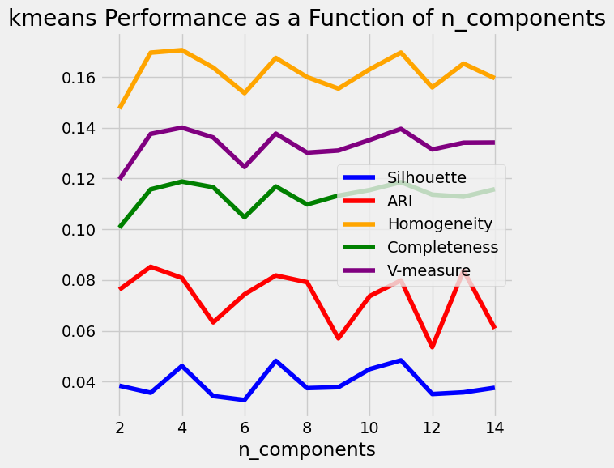
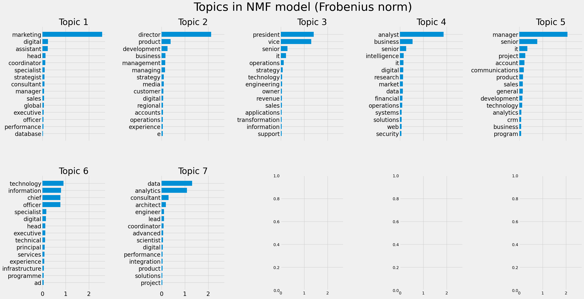
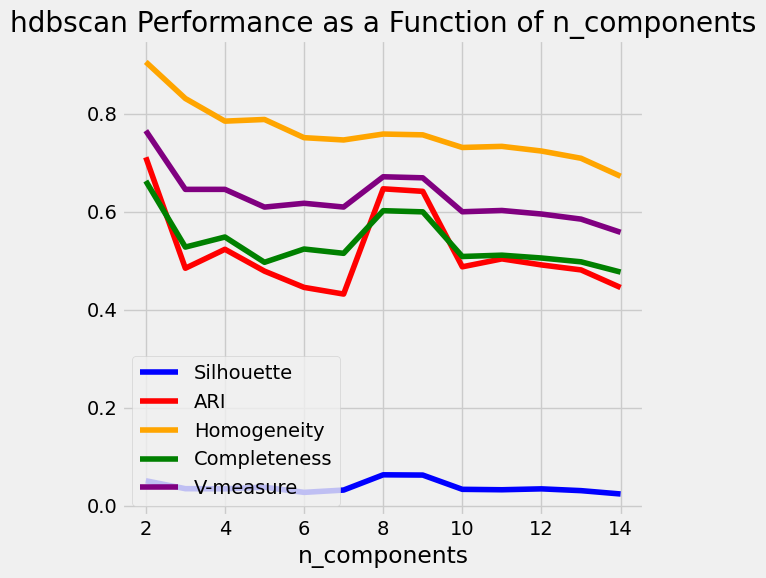
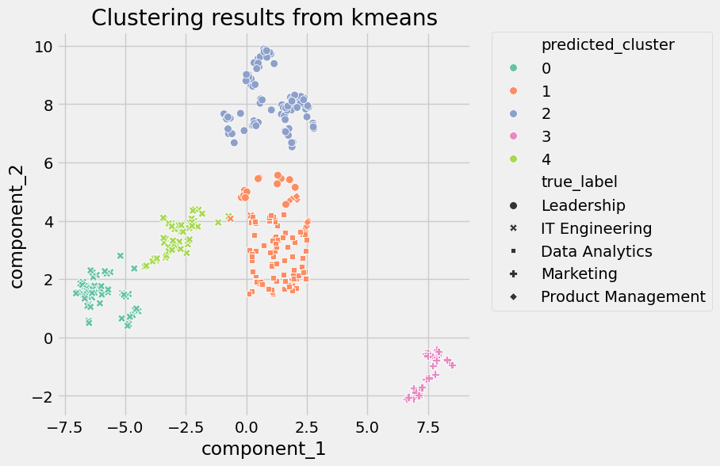

# 1. Overview

The goal of this project was to analyze short texts and find appropriate clusterings for them. These short texts represent go-to-market roles, campaigns, or touchpoints from
customer journey data. Clustering the texts helps identify patterns that can be used for tasks such as grouping similar job roles for targeted outreach, or grouping campaign types for performance analysis.

# 2. Data Assumptions

Since the analysis involves short texts, I decided to use tools and NLP techniques that don't require large amounts of textual data to gain insights. Short texts typically lack grammatical structure, so analyzing this data for parts of speech, syntax, or other linguistic features (such as part-of-speech tags and dependency parses) reserved for large document analysis probably won't be useful in this context. Therefore, I focus on more straightforward approaches, including word counts (unigrams and bigrams for clustering) and TF-IDF (for topic extraction).

# 3. Tech Stack

Python is my programming language of choice because of the availability of machine learning and natural language processing libraries. I am using the following libraries:
- NLTK: customized text tokenization behavior
- scikit-learn: word vectorization, algorithm development and analysis
- matplotlib, seaborn: visualizations
- pandas: data manipulation and processing, data input and output
- numpy: data manipulation and processing
- umap: dimensionality reduction

# 4. Preparation and Infrastructure

## 4.1 Data Cleaning

The short texts seemed inconsistently formatted in different ways. Here are the steps I took to clean the short texts:
- removed dashes (sometimes used as semicolons rather than contractions, but not that important to keep).
- removed stopwords (conjunctions and small words, except I left "it" as it usually stands for "information technology").
- removed other punctuation (periods and other symbols).
- converting the texts to lowercase for consistency in capitalization.

Here are steps I didn't take:
- expand abbreviations to their longer versions, since it's possible that my interpretation could be inconsistent with other interpretations.
- perform language translation on some of the short texts. The examples were few, so I leave that to upstream changes if the texts are all desired to be in English.
- lemmatize words, since the pluralization of some words hold more information as is (e.g. "accounts payable").

## 4.2 Feature Development

Since these are short texts, I used a simple boolean feature for unigrams and bigrams.

I didn't use other linguistic features, such as part-of-speech tags or dependency parses, because these short texts are not full and complete grammatical sentences. Arguably, analysis can be conducted on the structure of these phrases, which at first glance would amount to noun phrase analysis, but that would require further research into the semantics and syntax of these short texts.

I also didn't use TF-IDF or a word count vectorizer to build my features. Many of the same words were repeated in some of the short texts, and I didn't want duplicated words to bias my analysis and results, since my goal for this project was to determine semantic and not lexicographical features of the data.

## 4.3 Pipeline Creation

The processing pipeline for the data was created using scikit-learn's `Pipeline` class. The pipelines all consist of 3 stages: data preparation, dimensional reduction, and clustering.

# 5. Data Analysis

For this project, I wanted to answer 2 questions:
1. How many cluster groups are required for the given data?
2. What should the cluster groups be called?

The first question can be answered by experimenting with different clustering algorithms. The second question can be answered with either visual inspection of defined clusters, topic extraction algorithms, or providing this information to an LLM for classification.

## 5.1 Dimensionality Reduction

In order to get a sense of how these short texts are related to each other, reducing the dimensionality of the data is important. Instead of trying to look at hundred-dimensional vectors of data, looking at a 2-dimensional vector on a Cartesian coordinate plane is much easier to interpret. For very high-dimensional data, it often is the case that the first 2 or 3 principal components account for most of the variation in the data, which allows for visualization on a 2- or 3-dimensional plane while preserving the properties of the data.

### 5.1.1 PCA

PCA is one of the oldest dimensionality reduction algorithms. The below graph shows that PCA has grouped data into dense clusters of varying shapes.


### 5.1.2 UMAP

UMAP is similar to t-SNE from scikit-learn. I tried to use t-SNE in my processing pipeline, but the nature of the implementation in scikit-learn made configuration more difficult than necessary. [1] UMAP plugged right into my existing processing pipeline with little extra configuration. The belowe graph shows that UMAP has grouped data into more convex-looking clusters.


## 5.2 Clustering Algorithms

After seeing the scatterplots of the data after dimensionality reduction, I decided to use 2 combinations of dimensionality reduction and clustering algorithm.

### 5.2.1. PCA + HDBSCAN

I chose HDBSCAN here because it is capable of building clusters of varying density. Since the output of PCA resulted in non-convex regions, HDBSCAN was a good candidate for clustering.

### 5.2.2 UMAP + k-means

I chose k-means here because it works well with grouped regions of data that we can build centroids around. Since the output of UMAP resulted in convex regions, k-means was a good candidate for clustering.

## 5.3 Clustering Evaluation

I selected a couple of evaluation metrics that I thought would be useful for this project.

### 5.3.1 Silhouette Coefficient [2]

This metric is better suited to dense and well-separated clusters and may return lower numbers for density-based or non-convex clusters. However, I am still using this as a metric since it's a good metric for measuring clustering algorithm performance if there is no labeled data.

### 5.3.2 Adjusted Rand Index (ARI) [3]

A function that measures the similarity of predicted vs. true labels. Even though labeled data is needed, ARI can also be used in an unsupervised setting to help decide which clustering algorithm to select. Also, no assumption is made on the cluster structure for this metric.

### 5.3.3 Homogeneity, Completeness, and V-measure [4]

- homogeneity: each cluster contains only members of a single class.
- completeness: all members of a given class are assigned to the same cluster.
- v-measure: harmonic mean of homogeneity and completeness

One of the advantages of these metrics is that no assumption is made on the cluster structure.

### 5.3.4 Scores




In both instances, I chose `n_components=7` as the optimal number of clusters. For k-means, I could take this number and start running label predictions. For HDBSCAN, I still needed to find the optimal values `min_cluster_size` (the minimum number of data points to be considered a cluster) and `min_samples` (the minimum number of data points to use to calculate distance metrics for cluster membership) that would get me the optimal number of clusters.

### 5.3.5 HDBSCAN Grid Search

I performed a grid search on HDBSCAN clustering with combinations of `min_cluster_size` and `min_samples` values. Each pair of numbers in the graph titles is a `(min_cluster_size, min_samples)` tuple. The tuple `(15, 4)` created 7 clusters, so those are the values I chose for my algorithm.


## 5.4 Cluster Categorization

Based on the evaluation scores of the clustering algorithms, I picked 7 clusters for both k-means and HDBSCAN. The graphs below show the 2 different clustering algorithms and their predicted labels. Colored labels are the algorithm predictions, and labels with shapes are the original labels from the dataset. Seeing how the labels with shapes don't match the algorithm clusterings well, this indicates to me that redefining the cluster labels may be necessary.


### 5.4.1 Cluster Feature Extraction

I used scikit-learn to extract the top words from each cluster to try and make analysis a little easier. scikit-learn has an example online [5] for performing topic extraction. The following graphs show top extracted unigrams using NMF, PLSA, and LDA. I used these top words as a start for creating and enhancing clusters.




### 5.4.2 LLM Classification

To try and assist with cluster definitions, I sent the top words from topic extraction to an LLM using the following prompt:

```
You are a helpful chatbot. Use only the following pieces of context to answer the question. Don't make up any new information:
Categorize the following group of data into one category, using as few words as possible:
```

The responses from the LLM were not uniformly formatted and varied in content, but they provided valuable insights into how I wanted to define my new clusters.

# 6. Cluster Updates

## 6.1 New Definitions

Combining the category suggestions from the LLM output and the top words from topic extraction, I created an updated list of cluster categories. Here is the list of new clusters and my rationale for choosing them:

- Data Analytics: terms such as `analytics`, `analyst`, `research`, `data`, and `strategist`.
- IT Engineering: `information technology` and `engineering` were terms predominantly found in these clusters.
- Leadership: clusters that seemed to mostly represent leadership roles in general.
- Marketing: terms such as `social media`, `demand generation`, `seo`; `marketing` was a common term as well, coupled with a title like `director` or `executive`.
- Product Management: terms such as `product`, `strategy`, `communications`, `accounts`, `customer`, and `project`.

Although I did not end up with 7 categories as indicated by my previous analysis, it is still important that I was able to analyze and categorize new clusters in a more informed manner.

## 6.2 Cluster Processing

I used the new clusters and their associated top words in a K-Nearest Neighbors (KNN) algorithm to assign new clusters to the original data. The top words from topic extraction were converted into feature vectors, then scaled and having their dimensionality reduced, as done before with the original data. The KNN algorithm was then used to assign new clusters to the original data, based on the new cluster categorization I did before.

Since KNN always tries to assign a cluster label to a data point, and the new categories did not include an "Other" category, any new data point will not have an "Other" label (this will be addressed in the Future Predictions section). Although, conversely, a density-based clustering algorithm like HDBSCAN can be used to find outliers that could be relabeled as "Other" for not falling within a cluster.

# 7. Final Results

## 7.1 Evaluation

Here are a couple of graphs showing the performance of k-means and HDBSCAN over the data now. Further steps can be taken from this point:
- choose a new optimal number of clusters
- find new optimal values for HDBSCAN `min_cluster_size` and `min_samples`
- redefining cluster definitions (see next section)

In general, however, the metrics themselves are much higher, which is an improvement from before.




## 7.2 Cluster Categorization

The graphs below show the 2 different clustering algorithms and their new predicted labels. It looks like the clusterings are more homogeneous now, but additional work needs to be done to better define these topics. Next steps could be to investigate the clusters for patterns, and/or to involve subject-matter experts to refine cluster definitions. We can also try out different cluster sizes and number of clusters, given that the definition and distribution of the data may have changed during analysis.




One note of interest between these 2 graphs is that the "IT Engineering" cluster is not shown in the graph that used PCA. I am not sure about the root cause, but one suspicion I have is that those data points were not picked up during KNN calculations because of the dimensionality reduction process.

Another note of interest is that I noticed how HDBSCAN was having trouble with the less dense groupings of data near the top and bottom of the graph, so I decided to try an Agglomerative Clustering algorithm.


The groupings look much better with the Agglomerative Clustering algorithm!

# 8 Future Data Predictions

## 8.1 K-Nearest Neighbors (KNN)

It will most likely be the case that new entries will be added to the existing data in the future. Now that we have defined our new clusters, we can use a different unsupervised algorithm called K-Nearest Neighbors. Based on the content of new data (either from batch or real-time processing), we can decide which cluster the new data could belong to and automatically label it. We can also set the prediction threshold of the KNN algorithm to certain value so that our labeling is more confident. New data that does not meet that threshold can be categorized as other and either be manually labeled or analyzed in the future as part of a feedback loop to this entire system.

# 9. End-to-end Pipeline

Although this system may not be fully automatable, having a sense of how to analyze the data to make it easier to comprehend by a human is very important. Below is a rough diagram of the end-to-end flow of the entire system, including points at which humans should be involved:


# 10. Future Work

## 10.1 Predictive Strength

Predictive strength is a more automated way to determine the number of clusters. This involves splitting the data into training and test sets, and measuring whether cluster assignments on the training set are good enough to be used to cluster the test set. Calculations include computing the membership of a data point within a cluster (in the form of a co-membership matrix), the proportion of data pairs in the same cluster, and taking the minimum quantity over all test clusters. Studies suggest that a predictive strength value above 0.8 indicates a reasonable number of clusters.

## 10.2 Dimensionality Reduction Chaining

"It is highly recommended to use another dimensionality reduction method (e.g. PCA for dense data or TruncatedSVD for sparse data) to reduce the number of dimensions to a reasonable amount (e.g. 50) if the number of features is very high. This will suppress some noise and speed up the computation of pairwise distances between samples." [6]

## 10.3 Clustering Algorithms

Other clustering algorithms I could have tried out are Gaussian Mixture Model (GMM) or hierarchical clustering (though there are many more than these).

GMM is not a hard clustering algorithm like k-means or HDBSCAN; cluster assignments are considered soft, in the sense that a data point belongs to a cluster with a certain probability. GMM clusters can also be ellipsoid in shape, unlike k-means where clusters can only be circular. Maximizing the likelihood of all data points in GMM requires some model training and hyperparameter tuning, which can be left as a future exercise.

Hierarchical (top-down) or agglomerative (bottom-up) clustering with a Ward linkage strategy would have also been good to use for this project, based on the distribution of data after dimensionality reduction. Since I had already chosen k-means and HDBSCAN as 2 possible clustering algorithms, more hierarchical clustering can be left as a future exercise as well.

## 10.4 Evaluations

I tried a library called `custeval` [7] that tries to detect the optimal number of clusters. Although very easy to set up, `clusteval` gave me an optimal number of clusters that was 2 to 3 times larger than my own analysis had shown. Rather than try to investigate configuration options, I am just going to mention that `clusteval` is a library that will basically do grid search on clustering algorithms.

# 11. Footnotes

1. https://stackoverflow.com/questions/70251175/how-to-use-t-sne-inside-the-pipeline
2. https://scikit-learn.org/stable/modules/clustering.html#silhouette-coefficient
3. https://scikit-learn.org/stable/modules/clustering.html#rand-index
4. https://scikit-learn.org/stable/modules/clustering.html#homogeneity-completeness-and-v-measure
5. https://scikit-learn.org/stable/auto_examples/applications/plot_topics_extraction_with_nmf_lda.html#
6. https://scikit-learn.org/stable/modules/generated/sklearn.manifold.TSNE.html
7. https://pypi.org/project/clusteval/
